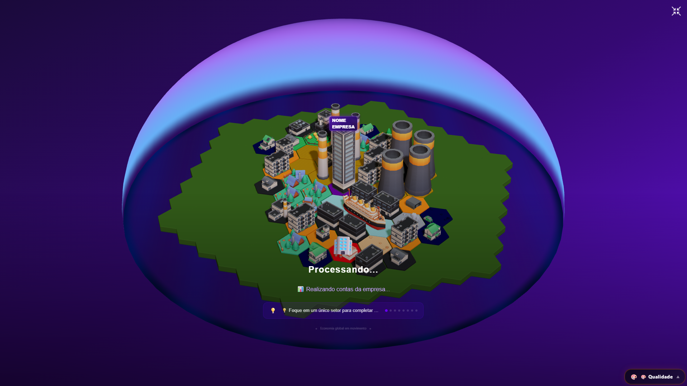
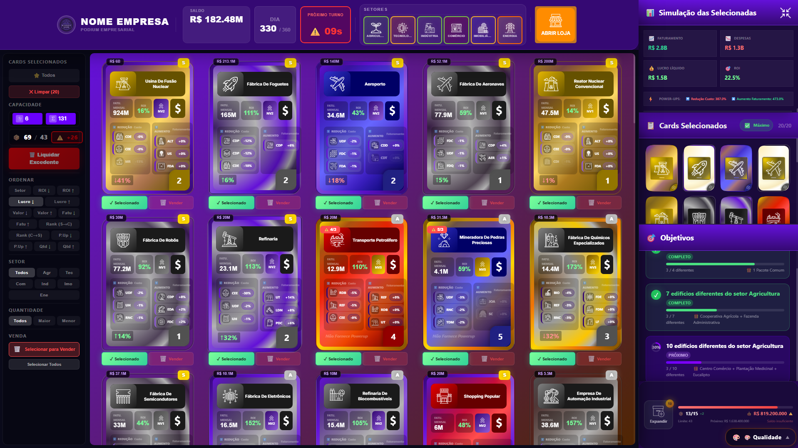
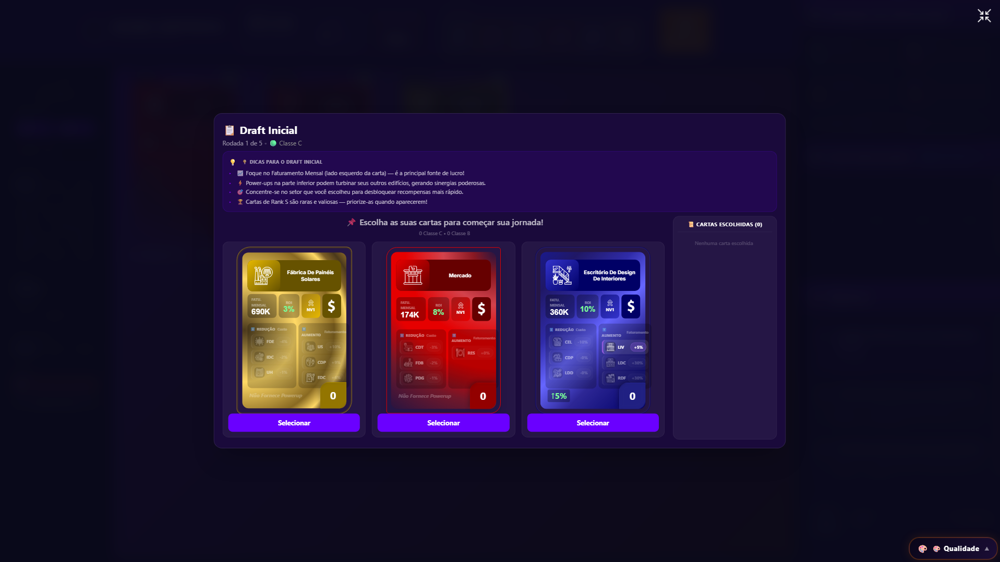

# 🎮 Business Game

### Simulação Econômica e Estratégia

Jogo autoral de **estratégia e simulação econômica**, no qual o jogador assume o papel de CEO e administra uma corporação ao longo de **360 dias**.

O projeto foi desenvolvido com foco em **lógica de negócio, gerenciamento de estado, tomada de decisão e experiência do usuário**, transformando uma ideia própria em uma aplicação web funcional.

🔗 **Deploy:** https://joguinho-de-lojas.vercel.app/

---

## 🎯 Sobre o projeto

O **Business Game** é uma simulação econômica na qual o jogador precisa administrar uma corporação, tomar decisões estratégicas e acompanhar o impacto dessas decisões ao longo de um ciclo de 360 dias.

A proposta combina elementos de:

* 📈 Simulação econômica
* 🏢 Gestão empresarial
* 🎯 Missões e objetivos
* 🃏 Sistema de cartas
* 📦 Gerenciamento de inventário
* ⚡ Sinergias entre construções
* 💰 Gestão financeira
* 📊 Análise de indicadores
* 🗺️ Construção dinâmica da corporação

O principal objetivo técnico foi criar uma aplicação em que diferentes sistemas de negócio interagissem entre si de maneira consistente.

---

# 🕹️ Como funciona

O jogador assume o papel de **CEO** e precisa administrar sua corporação durante 360 dias.

Ao longo da simulação, diferentes decisões afetam o desempenho da empresa.

```text
                   👨‍💼 CEO
                     │
                     ▼
              ┌──────────────┐
              │   Estratégia │
              └──────┬───────┘
                     │
       ┌─────────────┼─────────────┐
       ▼             ▼             ▼
   📈 Economia    🃏 Cartas     🎯 Missões
       │             │             │
       └─────────────┼─────────────┘
                     ▼
              🏢 Corporação
                     │
                     ▼
              💰 Resultados
                     │
                     ▼
              📊 Indicadores
```

---

# ✨ Principais sistemas

## 📈 Economia dinâmica

O desempenho da corporação é influenciado por diferentes estados do mercado.

Entre os estados econômicos estão:

* 🔥 Aquecida
* 📈 Progressiva
* ⚖️ Estável
* 📉 Declínio
* 🔻 Recessão

As condições econômicas influenciam diretamente o desempenho dos setores e o faturamento da corporação.

Isso faz com que uma estratégia que funciona em determinado momento possa precisar ser adaptada conforme as condições do mercado mudam.

---

## 🎯 DNA da Empresa — Sistema de Missões

O jogo possui um sistema de missões chamado **DNA da Empresa**.

As missões possuem diferentes níveis de dificuldade e recompensas, permitindo que o jogador defina objetivos e desenvolva sua estratégia de crescimento.

O sistema transforma objetivos de curto e médio prazo em parte da tomada de decisão durante a simulação.

---

## 🃏 Sistema de Cartas e Draft

O Business Game utiliza um sistema de cartas para representar diferentes possibilidades dentro da corporação.

O jogador precisa:

* Selecionar cartas
* Gerenciar o inventário
* Controlar limites de estoque
* Administrar excedentes
* Avaliar quais elementos fazem sentido para sua estratégia

O sistema adiciona uma camada de decisão estratégica à simulação econômica.

---

## ⚡ Sistema de Sinergias — PowerUps

Os edifícios da corporação podem interagir através de **sinergias**.

Essas interações podem proporcionar:

* Redução de custos
* Aumento de faturamento
* Combinações estratégicas entre construções

Dessa forma, o jogador não precisa analisar cada construção de maneira isolada.

A organização da corporação também passa a fazer parte da estratégia.

---

## 💰 Gestão financeira

O jogador possui diferentes indicadores para acompanhar o desempenho da corporação.

Entre eles:

* 💰 Lucro
* 📊 ROI
* 🏦 Patrimônio
* 📈 Valor da empresa
* 🏢 Desempenho por setor

Essas informações ajudam o jogador a avaliar as consequências de suas decisões durante a simulação.

---

## 🗺️ Mapa dinâmico da corporação

Uma das características do projeto é a representação visual da corporação.

O mapa é **gerado dinamicamente a partir dos elementos disponíveis no inventário**, transformando as escolhas estratégicas do jogador em uma representação visual do patrimônio e das construções realizadas.

---

# 📸 Demonstração

## 🗺️ Mapa gerado através do inventário

Visualização do mapa da corporação gerado dinamicamente a partir dos elementos disponíveis no inventário.

A interface transforma as escolhas estratégicas do jogador em uma representação visual do seu patrimônio e das construções realizadas durante a simulação.

<!-- SUBSTITUA pelo caminho da imagem -->



---

## 🏢 Interface principal e gestão da corporação

Interface principal do Business Game, apresentando o painel de controle da corporação, gerenciamento de recursos, inventário, indicadores financeiros e sistemas utilizados para apoiar a tomada de decisões estratégicas ao longo dos 360 dias de jogo.

<!-- SUBSTITUA pelo caminho da imagem -->



---

## 🎮 Simulação econômica e estratégia

Visão geral da aplicação publicada, apresentando a experiência de gerenciamento da corporação e os diferentes sistemas envolvidos na simulação econômica.

<!-- SUBSTITUA pelo caminho da imagem -->



---

# 🧠 Principais desafios

Um dos maiores desafios do projeto foi desenvolver e integrar **múltiplos sistemas de negócio que dependem uns dos outros**, mantendo o comportamento da aplicação consistente.

Entre os principais desafios técnicos estiveram:

### 🔄 Gerenciamento de estado

O jogo possui diversas informações que precisam permanecer sincronizadas durante a simulação.

Por exemplo:

```text
Economia
   ↓
Desempenho dos setores
   ↓
Faturamento
   ↓
Indicadores financeiros
   ↓
Decisões do jogador
```

Essas informações precisam ser atualizadas sem comprometer os demais sistemas da aplicação.

---

### ⚖️ Balanceamento econômico

Foi necessário criar regras para que diferentes decisões apresentassem consequências diferentes dentro da economia do jogo.

O desafio não era apenas implementar funcionalidades, mas fazer com que os sistemas trabalhassem juntos de maneira coerente.

---

### 🧩 Integração entre sistemas

O projeto possui diferentes sistemas independentes que precisam interagir:

```text
Economia
   │
   ├── Setores
   │      │
   │      └── Faturamento
   │
   ├── Cartas
   │      │
   │      └── Inventário
   │
   ├── Construções
   │      │
   │      └── Sinergias
   │
   └── Missões
          │
          └── Recompensas
```

O desafio foi permitir que essas relações acontecessem de maneira previsível e organizada.

---

### 🎨 Apresentação de informações complexas

Como o jogo possui muitos indicadores e sistemas simultâneos, também foi necessário pensar em como apresentar essas informações sem deixar a interface confusa.

A experiência do usuário foi considerada junto com a implementação das regras de negócio.

---

# 🏗️ Tecnologias utilizadas

### Front-end

* React
* JavaScript
* Tailwind CSS

### Gerenciamento e arquitetura

* Context API

### Interface e experiência

* Framer Motion
* Chart.js

### Desenvolvimento

* Git
* GitHub

---

# 🏛️ Organização do projeto

A aplicação foi estruturada de forma modular, separando diferentes responsabilidades da aplicação.

Entre os principais conceitos utilizados estão:

```text
Componentes
     │
     ├── Interface
     │
     ├── Sistemas do jogo
     │
     ├── Gerenciamento de estado
     │
     └── Regras de negócio
```

A separação dessas responsabilidades foi importante para conseguir evoluir o projeto à medida que novos sistemas eram adicionados.

---

# 🔄 Ciclo da simulação

A experiência principal do jogo acontece durante um ciclo de **360 dias**.

```text
        INÍCIO
           │
           ▼
    Recursos iniciais
           │
           ▼
     Escolhas estratégicas
           │
           ▼
      Evolução da
       corporação
           │
           ▼
    Mudanças econômicas
           │
           ▼
     Novas decisões
           │
           ▼
       DIA 360
           │
           ▼
    Resultado final
```

---

# 📚 O que desenvolvi com este projeto

O Business Game foi um dos projetos mais importantes da minha evolução como desenvolvedor porque exigiu muito mais do que a construção de telas.

Durante o desenvolvimento, aprofundei conhecimentos em:

* React
* JavaScript
* Gerenciamento de estado
* Context API
* Lógica de negócio
* Estruturação de aplicações complexas
* Desenvolvimento de interfaces
* UI/UX
* Análise de dados
* Simulação econômica
* Integração entre diferentes sistemas
* Git e GitHub

O projeto também me ensinou a transformar uma ideia inicialmente abstrata em um sistema com **regras, estados, interações e ciclos próprios**.

---

# 🚀 Próximas evoluções

Por ser um projeto autoral, o Business Game possui espaço para continuar evoluindo.

Entre as possibilidades estão:

* Novos sistemas de estratégia
* Expansão dos setores econômicos
* Novas cartas e sinergias
* Novos eventos econômicos
* Melhorias na análise financeira
* Expansão do mapa da corporação
* Novos objetivos e missões

---

# 👨‍💻 Desenvolvedor

**Paulo Miguel**

Estudante de Engenharia de Software e Desenvolvedor Full-Stack em formação.

🔗 **GitHub:** PauloMiguelVIdal
🔗 **LinkedIn:** https://www.linkedin.com/in/paulo-miguel-vidal-da-silva/

---

## 🎮 Acesse o projeto

**Business Game — Simulação Econômica e Estratégia**

🔗 https://joguinho-de-lojas.vercel.app/
